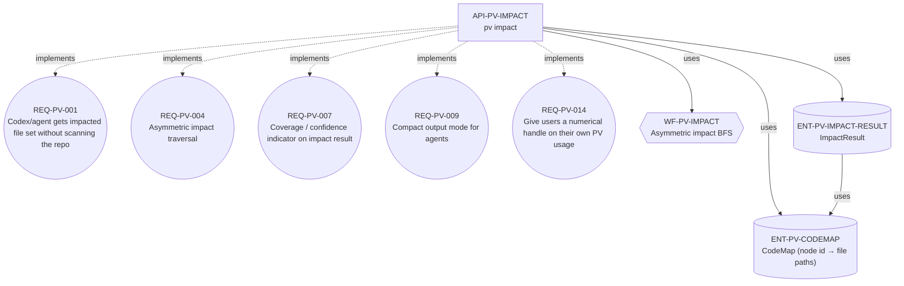
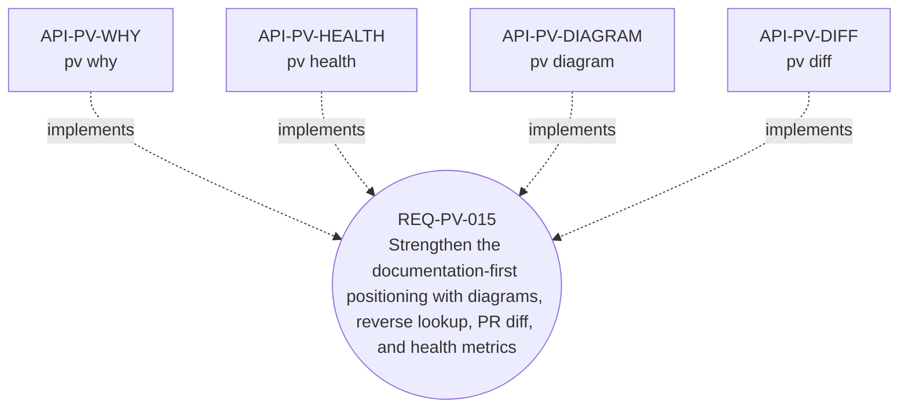
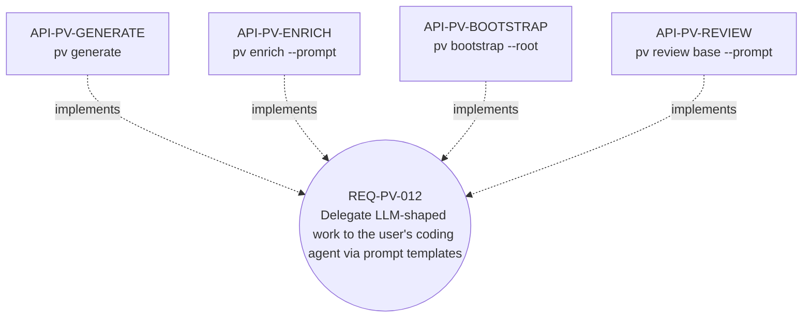

# 아키텍처

Polaris Vibe Spec의 내부 설계 노트. 사용자 관점의 워크플로는
[`ADOPTION.ko.md`](ADOPTION.ko.md) ([English](ADOPTION.en.md))에 있음.
이 문서는 *왜* 도구가 지금의 모습으로 되어 있는지를 다룹니다.

> English version: [ARCHITECTURE.md](ARCHITECTURE.md).

## 다이어그램 (자동 생성)

아래 세 다이어그램은 프로젝트 자체의 `.polaris/graph.json`에서
`pv diagram`으로 생성됩니다. `npm run diagrams`가 재생성하며
(graph와 embed된 블록이 어긋나면 CI 실패), 다른 view를 보려면
로컬에서: `pv diagram --node <ID> --depth <N> [-f graphviz]`.

### 헤드라인 product: impact 분석

`API-PV-IMPACT`는 "agent에게 좁힌 file 집합 제공"이라는 원래 명령.
다섯 개 requirement 노드 (PV-001/004/007/009/014)를 implement하고,
asymmetric BFS workflow를 사용하며, `CodeMap`과 `ImpactResult` 타입을
읽음.

<!-- BEGIN diagram:impact-analysis -->



<!-- END diagram:impact-analysis -->

### Documentation 도구 (새 포지셔닝)

bench-003 reframe 이후, agent가 PV를 호출하든 안 하든 작동하는
documentation 가치를 강화하기 위해 4개 명령이 추가됨.

<!-- BEGIN diagram:documentation-tools -->



<!-- END diagram:documentation-tools -->

### `--prompt`로 agent에 위임

`pv` 자체는 LLM을 호출하지 않음. 의미 인식이 도움이 되는 작업
(generate, bootstrap, enrich)에서 `--prompt` 모드는 사용자의 agent가
자기 Read/Edit 도구로 따를 수 있는 구조화된 prompt를 출력.

<!-- BEGIN diagram:agent-delegation -->



<!-- END diagram:agent-delegation -->

다른 view가 필요하면 `pv diagram --node <id> --depth <n>`이 한 노드를
중심으로 한 이웃을 출력. 인자 없는 `pv diagram`은 전체 그래프 — 47
노드는 prose에 embed하기엔 너무 빽빽하지만 Graphviz로 파이프하면 유용:
`pv diagram -f graphviz | dot -Tsvg > arch.svg`.

## Pipeline (글로 표현)

```
Intent (자연어)
        │
        ▼
  intentToGraph (휴리스틱 컴파일러; --llm 플래그는 agent에 위임)
        │
        ▼
  Graph (.polaris/graph.json, source of truth)
        │
        ├─ ops (search, link)        ─► pv query / pv link / pv list / pv show
        ├─ traverse (asymmetric BFS) ─► pv impact ──┐
        └─ graphToMarkdown           ─► pv export   │
                                                    ▼
                              CodeMap (.polaris/codemap.json)
                                                    │
                                                    ▼
                              { impacted_nodes, impacted_files,
                                inferred_files, warnings, coverage }
```

Graph는 JSON; markdown view는 graph에서 재생성되며 source of truth로
다시 읽히지 않음 (예외 한 가지: `pv promote`가 `spec/<id>.md`의
*prose only* 편집을 `graph.json`에 적용).

## Asymmetric impact traversal

대칭 BFS는 코드베이스의 절반을 반환해서 토큰 절감 효과를 잠식함.
edge 방향은 "내가 N을 변경할 때 무엇이 변하나" 기준으로 해석:

| 관계 | traverse 방향 |
|---|---|
| `depends_on` | 역방향 — N에 의존하는 모두가 영향받음 |
| `implements` | 역방향 — N의 구현체들이 영향받음 |
| `uses` | 역방향 — N의 호출자들이 영향받음 (A가 N을 쓰면, N 변경 시 A가 깨짐) |
| `affects` | 정방향 — N이 이미 무엇에 영향 미친다고 선언함 |

기본 depth는 3. cycle은 dedup. 누락된 relation target은 non-fatal
경고로 처리.

결과에는 `coverage` 필드 (`narrow` / `broad` / `global`)도 포함되며,
`impacted_nodes.length / total_nodes` 기반. agent는 이걸 보고 file
집합을 신뢰할지 grep으로 fallback할지 결정:

- `< 25%` → `narrow` — 좁은 변경, 집합 신뢰.
- `25–60%` → `broad` — 상당 비율; grep 추가 고려.
- `> 60%` → `global` — root가 foundational, 연쇄 예상; grep도
  비슷하게 빠를 것.

## CodeMap: explicit vs inferred

`.polaris/codemap.json`이 신뢰 source. 노드에 명시적 entry가 없으면
resolver가 tag/domain 기반으로 `src/<domain-lowercased>/**`로 fallback.
두 결과는 **별도 필드**로 반환됨 (`impacted_files` vs `inferred_files`)
— glob 추측을 ground truth로 다루지 않게 함.

Codemap entry는 host OS에 관계없이 POSIX path 구분자(`/`)로 저장됨.
`pv validate`는 orphan source file을 flag (codemap entry가 참조하지
않는 src/ 아래 path — graph drift의 1차 신호).

## 휴리스틱 intent 컴파일러

순수 함수, 오프라인. `--llm`은 agent에 위임하기 위한 seam
(`--llm` 대신 `pv generate --prompt` 사용); 휴리스틱 컴파일러 자체는
네트워크 호출 안 함.

- **도메인:** AUTH (auth/login/passkey/jwt/...), BILLING
  (pay/invoice/stripe/...), ORDER (order/cart/checkout/...), NOTIF
  (email/sms/push/...), USER (user/profile/...), 기본값 `GENERAL`.
- **타입:** HTTP 동사 prefix → `api`; flow/process/step/when…then →
  `workflow`; table/model/entity/schema → `entity`; 기본값 →
  `requirement`.
- **자동 관계:** 명시적 id 언급 + `implements REQ-…` →
  `implements`; `uses/calls/invokes` → `uses`; 그 외 → `affects`.
  같은 도메인 (cap 3) → `affects`. `depends_on`은 자동 생성 안 함.

## Task-shape classifier (`pv ask`)

bench-002 finding "PV-vs-grep은 task shape에 따라 다름"을 코드로
encoding:

| 감지된 shape | 추천 | 실증 근거 |
|---|---|---|
| Feature add (`add`, `implement`, `support`…) | `use_pv` | bench-002에서 cost 17-28%, tools 44-47% 절감 |
| Cross-domain feature (≥2 도메인 키워드) | `use_pv` | PV 가장 강한 win |
| Pure rename (`rename X to Y`, 화살표 형식, 코드-식별자 패턴) | `use_grep` | bench-002 task-3 — PV cost +65%, +44% tools |
| 일반 refactor (`refactor`, `move`, `extract`…) | `use_both` | PV로 scope, 그 안에서 grep |
| 기타 | `use_pv` | 기본값; `coverage` 먼저 확인 |

Classifier는 `{recommendation, reason}` 반환, agent는 그 필드로 라우팅.
docs가 아닌 코드로 encoding되어 있어 system prompt / CLAUDE.md가
정책으로 부풀지 않음.

## `--prompt`로 agent에 위임

PV는 로컬 CLI; LLM provider에 API 호출 안 함. 의미 인식이 도움 되는
명령 — `generate`, `bootstrap`, `enrich` — 은 `--prompt` 플래그를
받음. 사용자의 agent가 자기 Read/Edit 도구로 따를 수 있는 구조화된
Markdown prompt를 출력. PV가 제공하는 것:

- schema reminder (노드 필드, 관계 타입, ID 형식),
- 관련 컨텍스트 (대상 도메인의 peer, 현재 노드 상태,
  읽어야 할 codemap 파일),
- 번호 매긴 task,
- 검증 블록 (`pv validate`, `pv export-all`).

Agent가 LLM을 제공. PV 안에 API 키 관리, 모델 선택, 결제 path를
중복하지 않음.

## ID 형식

안정적, 결정론적, 재할당 안 됨.

- `REQ-<DOMAIN>-<NNN>` — 예: `REQ-AUTH-001`
- `API-<DOMAIN>-<SLUG>` — 예: `API-AUTH-LOGIN`
- `WF-<DOMAIN>-<SLUG>` — 예: `WF-AUTH-LOGIN`
- `ENT-<DOMAIN>-<NAME>` — 예: `ENT-AUTH-USER`

카운터는 `.polaris/counters.json`에 저장; 충돌은 결정론적으로
2-digit suffix 추가로 disambiguate.

## Markdown round-trip

`pv export-all`이 노드별 `spec/<id>.md`와 인덱스 `spec/README.md`를
씀. 각 파일은 `<!-- DO NOT EDIT — regenerate via pv export-all -->`
마커로 시작하지만, 사람(과 PR 리뷰어)이 JSON 건드리지 않고 prose만
고치고 싶을 때가 있음. `pv promote`가 spec/ 손편집을 엄격한
editable/structural split 하에서 수용:

| 필드 | 상태 |
|---|---|
| title, tags, description | 편집 가능 — graph.json에 적용됨 |
| id, type, domain, createdAt | 구조적 — 설명과 함께 거부 |
| outgoing relations | 구조적 — 거부, `pv link` 안내 |
| incoming relations | derived; 다음 export에서 조용히 덮어씀 |

Round-trip 불변: `pv export-all` → 편집 없음 → `pv promote`는 모든
노드를 `unchanged`로 보고.

## Layout

```
src/
  cli.ts                       commander entrypoint
  types.ts                     SpecNode, Relation, Graph, CodeMap, ImpactResult
  ids.ts                       ID minting + counter persistence
  output.ts                    JSON / fail helpers
  util/{atomic,paths}.ts
  graph/{store,ops,traverse}.ts
  compiler/{intentToGraph,graphToMarkdown,markdownParser,promptTemplate,taskShape}.ts
  context/codeMap.ts
  impact/analyze.ts
  commands/{generate,query,show,link,impact,export,exportAll,list,addFile,
            rmFile,validate,ask,bootstrap,enrich,promote,
            why,health,diagram,diff,stats}.ts
.polaris/
  graph.json                   source of truth
  codemap.json                 nodeId → string[] of paths
  counters.json                ID counter state
  specs/                       generated markdown views (do not hand-edit)
spec/                          이 repo의 자동 생성된 사람-읽기 view
                               (pv export-all로 재생성)
skills/pv/SKILL.md             Claude Code skill — drop-in agent wiring
docs/                          ADOPTION (en/ko), ARCHITECTURE (en/ko), POSITIONING
experiments/                   재현 가능한 토큰 절감 벤치마크
examples/                      auth 도메인 seed graph + codemap
```

## Out of scope

에디터 없음, GUI 없음, 네트워크 호출 없음 (LLM-shaped 작업은 모두
`--prompt`로 위임), DB 없음, 클라우드 없음, 데몬 없음, git 통합 없음,
markdown-as-source-of-truth 없음 (`pv promote` prose-only 예외만).
