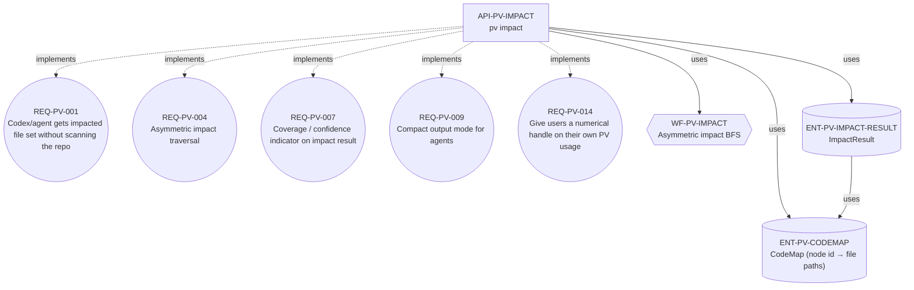
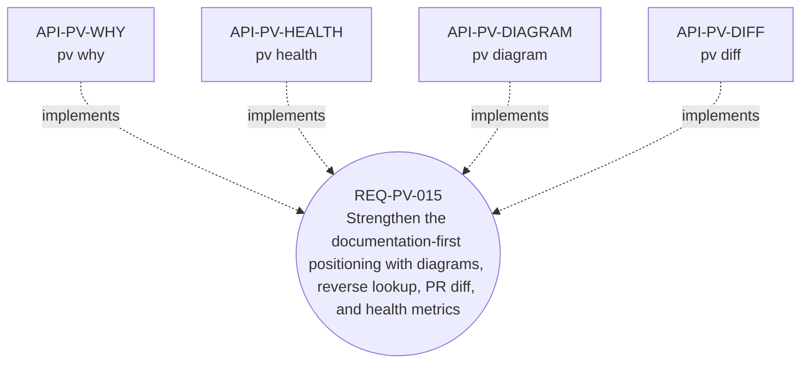
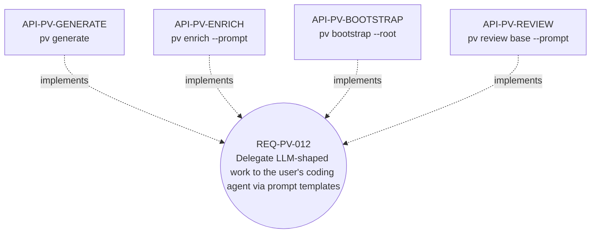

# Architecture

Internal design notes for Polaris Vibe Spec. The user-facing workflow lives
in [`ADOPTION.en.md`](ADOPTION.en.md) ([한국어](ADOPTION.ko.md)); this file
documents *why* the tool is shaped the way it is.

> 한국어 버전: [ARCHITECTURE.ko.md](ARCHITECTURE.ko.md).

## Diagrams (auto-generated)

The three diagrams below are emitted by `pv diagram` from the project's own
`.polaris/graph.json`. They're regenerated by `npm run diagrams` (CI fails
if the embedded blocks drift from the graph). To produce a different view
locally: `pv diagram --node <ID> --depth <N> [-f graphviz]`.

### The headline product: impact analysis

`API-PV-IMPACT` is the original "agent gets a focused file set" command.
It implements five requirement nodes (PV-001/004/007/009/014), uses the
asymmetric BFS workflow, and reads the `CodeMap` and `ImpactResult` types.

<!-- BEGIN diagram:impact-analysis -->



<!-- END diagram:impact-analysis -->

### Documentation tools (the new positioning)

After the bench-003 reframe, four commands were added that strengthen
the documentation value (independent of any agent invoking PV).

<!-- BEGIN diagram:documentation-tools -->



<!-- END diagram:documentation-tools -->

### Agent delegation via `--prompt`

`pv` itself never calls an LLM. For tasks that benefit from semantic
intelligence — generate, bootstrap, enrich — a `--prompt` mode emits a
structured prompt the user's agent runs with its own Read/Edit tools.

<!-- BEGIN diagram:agent-delegation -->



<!-- END diagram:agent-delegation -->

For any other view, `pv diagram --node <id> --depth <n>` produces the
neighborhood centered on a node. `pv diagram` (no args) renders the
whole graph; at 47 nodes the result is too dense for prose, but useful
piped through Graphviz: `pv diagram -f graphviz | dot -Tsvg > arch.svg`.

## Pipeline (in words)

```
Intent (natural language)
        │
        ▼
  intentToGraph (heuristic compiler; --llm flag delegates to your agent)
        │
        ▼
  Graph (.polaris/graph.json, source of truth)
        │
        ├─ ops (search, link)        ─► pv query / pv link / pv list / pv show
        ├─ traverse (asymmetric BFS) ─► pv impact ──┐
        └─ graphToMarkdown           ─► pv export   │
                                                    ▼
                              CodeMap (.polaris/codemap.json)
                                                    │
                                                    ▼
                              { impacted_nodes, impacted_files,
                                inferred_files, warnings, coverage }
```

The graph is JSON; the markdown view is regenerated from the graph and
never read back as a source of truth (with one exception: `pv promote`
applies *prose-only* edits from `spec/<id>.md` to `graph.json`).

## Asymmetric impact traversal

Symmetric BFS over the graph would return half the codebase and burn the
token savings the tool exists to provide. Edge direction is interpreted
relative to "what changes when I change N":

| Relation | Direction traversed |
|---|---|
| `depends_on` | reverse — anyone who depends on N is impacted |
| `implements` | reverse — implementers of N are impacted |
| `uses` | reverse — callers of N are impacted (if A uses N, changing N breaks A) |
| `affects` | forward — N already declares what it affects |

Default depth is 3. Cycles are de-duplicated. Missing relation targets
become non-fatal warnings.

The result also carries a `coverage` field (`narrow` / `broad` / `global`)
based on `impacted_nodes.length / total_nodes`, so an agent can decide
whether to trust the file set or fall back to grep:

- `< 25%` → `narrow` — focused change, trust the set.
- `25–60%` → `broad` — substantial fraction; consider also grepping.
- `> 60%` → `global` — root is foundational, expect cascades; grep is
  probably as fast.

## CodeMap: explicit vs inferred

`.polaris/codemap.json` is the trusted source. If a node has no explicit
entry, the resolver falls back to `src/<domain-lowercased>/**` based on
tags/domain. The two are returned in **separate fields** (`impacted_files`
vs `inferred_files`) so the agent never treats a glob guess as ground
truth.

Codemap entries are stored with POSIX path separators (`/`) regardless of
the host OS. `pv validate` flags orphan source files (paths under `src/`
that no codemap entry references — the leading indicator of graph drift).

## Heuristic intent compiler

Pure-function and offline. `--llm` is the seam for delegating to your
agent (`pv generate --prompt` instead of `--llm`); the heuristic compiler
itself never makes a network call.

- **Domains:** AUTH (auth/login/passkey/jwt/...), BILLING
  (pay/invoice/stripe/...), ORDER (order/cart/checkout/...), NOTIF
  (email/sms/push/...), USER (user/profile/...), fallback `GENERAL`.
- **Type:** HTTP-verb prefix → `api`; flow/process/step/when…then →
  `workflow`; table/model/entity/schema → `entity`; default →
  `requirement`.
- **Auto-relations:** explicit id mention with `implements REQ-…` →
  `implements`; with `uses/calls/invokes` → `uses`; otherwise →
  `affects`. Same domain (cap 3) → `affects`. Never auto-mints
  `depends_on`.

## Task-shape classifier (`pv ask`)

Encodes the bench-002 finding that PV-vs-grep is task-shape dependent:

| Detected shape | Recommendation | Empirical basis |
|---|---|---|
| Feature add (`add`, `implement`, `support`…) | `use_pv` | bench-002 saved 17–28% cost, 44–47% tools |
| Cross-domain feature (≥2 domain keywords) | `use_pv` | strongest PV win |
| Pure rename (`rename X to Y`, arrow forms, code-identifier patterns) | `use_grep` | bench-002 task-3 — PV cost +65%, +44% tools |
| Generic refactor (`refactor`, `move`, `extract`…) | `use_both` | PV for scope, grep within those files |
| Anything else | `use_pv` | default; check `coverage` first |

The classifier returns `{recommendation, reason}` and the agent routes on
those fields. Encoded as code rather than docs so the system prompt /
CLAUDE.md doesn't grow with the policy.

## Agent delegation via `--prompt`

PV is a local CLI; it never makes API calls to an LLM provider. Commands
that benefit from semantic intelligence — `generate`, `bootstrap`,
`enrich` — accept a `--prompt` flag that emits a structured Markdown
prompt the agent can follow with its own Read/Edit tools. PV provides:

- the schema reminder (node fields, relation types, ID format),
- the relevant context (peers in the target domain, current node state,
  codemap files to read),
- a numbered task,
- a verification block (`pv validate`, `pv export-all`).

The agent provides the LLM. This avoids duplicating API-key management,
model selection, and billing inside PV.

## ID format

Stable, deterministic, never reassigned.

- `REQ-<DOMAIN>-<NNN>` — e.g. `REQ-AUTH-001`
- `API-<DOMAIN>-<SLUG>` — e.g. `API-AUTH-LOGIN`
- `WF-<DOMAIN>-<SLUG>` — e.g. `WF-AUTH-LOGIN`
- `ENT-<DOMAIN>-<NAME>` — e.g. `ENT-AUTH-USER`

Counters live in `.polaris/counters.json`; collisions are disambiguated
deterministically by appending a 2-digit suffix.

## Markdown round-trip

`pv export-all` writes `spec/<id>.md` per node and `spec/README.md` as
the index. Each file starts with a `<!-- DO NOT EDIT — regenerate via pv
export-all -->` marker, but humans (and PR reviewers) sometimes want to
fix prose without touching JSON. `pv promote` accepts hand-edits in
spec/ under a strict editable/structural split:

| Field | Status |
|---|---|
| title, tags, description | editable — applied to graph.json |
| id, type, domain, createdAt | structural — rejected with explanation |
| outgoing relations | structural — rejected, points at `pv link` |
| incoming relations | derived; any edit silently overwritten on next export |

Round-trip invariant: `pv export-all` → no edits → `pv promote` reports
every node as `unchanged`.

## Layout

```
src/
  cli.ts                       commander entrypoint
  types.ts                     SpecNode, Relation, Graph, CodeMap, ImpactResult
  ids.ts                       ID minting + counter persistence
  output.ts                    JSON / fail helpers
  util/{atomic,paths}.ts
  graph/{store,ops,traverse}.ts
  compiler/{intentToGraph,graphToMarkdown,markdownParser,promptTemplate,taskShape}.ts
  context/codeMap.ts
  impact/analyze.ts
  commands/{generate,query,show,link,impact,export,exportAll,list,addFile,
            rmFile,validate,ask,bootstrap,enrich,promote}.ts
.polaris/
  graph.json                   source of truth
  codemap.json                 nodeId → string[] of paths
  counters.json                ID counter state
  specs/                       generated markdown views (do not hand-edit)
spec/                          auto-generated human-readable view of THIS repo
                               (regenerated by pv export-all)
skills/pv/SKILL.md             Claude Code skill — drop-in agent wiring
docs/                          ADOPTION (en/ko), ARCHITECTURE (this file)
experiments/                   reproducible token-savings benchmarks
examples/                      seed graph + codemap for the auth domain
```

## Out of scope

No editor, no GUI, no network calls (all LLM-shaped work delegates via
`--prompt`), no DB, no cloud, no daemon, no git integration, no
markdown-as-source-of-truth (only the prose-promote special case).
