<!-- DO NOT EDIT — regenerate via `pv export-all`. Source: .polaris/graph.json -->

# PV domain

16 requirements · 24 APIs · 8 workflows · 5 entities · 78 codemap files

```mermaid
graph TD
  REQ-PV-001(("REQ-PV-001<br/>Codex/agent gets impacted file set without scanning the repo"))
  REQ-PV-002(("REQ-PV-002<br/>Graph is the source of truth; markdown is a regenerated view"))
  REQ-PV-003(("REQ-PV-003<br/>CLI is the only control surface"))
  REQ-PV-004(("REQ-PV-004<br/>Asymmetric impact traversal"))
  ENT-PV-NODE[("ENT-PV-NODE<br/>SpecNode + Relation + Graph types")]
  ENT-PV-CODEMAP[("ENT-PV-CODEMAP<br/>CodeMap (node id → file paths)")]
  ENT-PV-OUTPUT[("ENT-PV-OUTPUT<br/>CLI output helpers")]
  ENT-PV-IMPACT-RESULT[("ENT-PV-IMPACT-RESULT<br/>ImpactResult")]
  WF-PV-PERSIST{{"WF-PV-PERSIST<br/>Atomic JSON persistence"}}
  WF-PV-IMPACT{{"WF-PV-IMPACT<br/>Asymmetric impact BFS"}}
  WF-PV-COMPILE{{"WF-PV-COMPILE<br/>Heuristic intent → graph compiler"}}
  WF-PV-IDS{{"WF-PV-IDS<br/>Stable ID minting"}}
  API-PV-GENERATE["API-PV-GENERATE<br/>pv generate <intent>"]
  API-PV-QUERY["API-PV-QUERY<br/>pv query <text>"]
  API-PV-SHOW["API-PV-SHOW<br/>pv show <id>"]
  API-PV-LINK["API-PV-LINK<br/>pv link <fromId> <toId> <relation>"]
  API-PV-IMPACT["API-PV-IMPACT<br/>pv impact <id>"]
  API-PV-EXPORT["API-PV-EXPORT<br/>pv export <id> --write"]
  API-PV-LIST["API-PV-LIST<br/>pv list --type --domain"]
  API-PV-ADD-FILE["API-PV-ADD-FILE<br/>pv add-file <id> <path>"]
  API-PV-RM-FILE["API-PV-RM-FILE<br/>pv rm-file <id> <path>"]
  API-PV-VALIDATE["API-PV-VALIDATE<br/>pv validate"]
  REQ-PV-005(("REQ-PV-005<br/>Tooling-level PV-vs-grep guidance, not just docs"))
  REQ-PV-006(("REQ-PV-006<br/>One-shot preamble — collapse query+list+impact into a single call"))
  REQ-PV-007(("REQ-PV-007<br/>Coverage / confidence indicator on impact result"))
  REQ-PV-008(("REQ-PV-008<br/>Codemap orphan + drift detection in pv validate"))
  REQ-PV-009(("REQ-PV-009<br/>Compact output mode for agents"))
  REQ-PV-010(("REQ-PV-010<br/>Auto-generated human-readable spec/ committed alongside the graph"))
  WF-PV-CLASSIFY{{"WF-PV-CLASSIFY<br/>Intent → task-shape classifier"}}
  API-PV-ASK["API-PV-ASK<br/>pv ask <intent>"]
  REQ-PV-015(("REQ-PV-015<br/>Strengthen the documentation-first positioning with diagrams, reverse lookup, PR diff, and health metrics"))
  API-PV-WHY["API-PV-WHY<br/>pv why <path>"]
  API-PV-HEALTH["API-PV-HEALTH<br/>pv health"]
  WF-PV-DIAGRAM{{"WF-PV-DIAGRAM<br/>Graph → Mermaid/Graphviz renderer"}}
  API-PV-DIAGRAM["API-PV-DIAGRAM<br/>pv diagram"]
  API-PV-DIFF["API-PV-DIFF<br/>pv diff <ref>"]
  REQ-PV-014(("REQ-PV-014<br/>Give users a numerical handle on their own PV usage"))
  API-PV-STATS["API-PV-STATS<br/>pv stats --since <iso-date>"]
  REQ-PV-013(("REQ-PV-013<br/>Edit spec/<id>.md by hand and promote prose changes back to graph.json"))
  WF-PV-MD-PARSE{{"WF-PV-MD-PARSE<br/>Markdown spec parser"}}
  API-PV-PROMOTE["API-PV-PROMOTE<br/>pv promote --dry-run"]
  REQ-PV-012(("REQ-PV-012<br/>Delegate LLM-shaped work to the user's coding agent via prompt templates"))
  WF-PV-PROMPT-TEMPLATE{{"WF-PV-PROMPT-TEMPLATE<br/>Prompt template builder for agent delegation"}}
  API-PV-ENRICH["API-PV-ENRICH<br/>pv enrich <id> --prompt"]
  REQ-PV-011(("REQ-PV-011<br/>Bootstrap an existing codebase into a PV-aware repo with one command"))
  API-PV-BOOTSTRAP["API-PV-BOOTSTRAP<br/>pv bootstrap --root <dir>"]
  API-PV-EXPORT-ALL["API-PV-EXPORT-ALL<br/>pv export-all --out <dir>"]
  REQ-PV-016(("REQ-PV-016<br/>Detect drift between hand-authored PRDs and the Intent graph"))
  API-PV-PRD-CHECK["API-PV-PRD-CHECK<br/>pv prd check paths..."]
  ENT-PV-PARSED-PRD[("ENT-PV-PARSED-PRD<br/>ParsedPrd")]
  API-PV-RENAME["API-PV-RENAME<br/>pv rename <oldId> <newId>"]
  API-PV-CHANGED["API-PV-CHANGED<br/>pv changed base"]
  API-PV-REVIEW["API-PV-REVIEW<br/>pv review base --prompt"]

  ENT-PV-CODEMAP -->|uses| ENT-PV-NODE
  ENT-PV-IMPACT-RESULT -->|uses| ENT-PV-NODE
  ENT-PV-IMPACT-RESULT -->|uses| ENT-PV-CODEMAP
  WF-PV-PERSIST -->|uses| ENT-PV-NODE
  WF-PV-IMPACT -->|uses| ENT-PV-NODE
  WF-PV-COMPILE -->|uses| ENT-PV-NODE
  WF-PV-IDS -->|uses| ENT-PV-NODE
  WF-PV-IDS -->|uses| WF-PV-PERSIST
  API-PV-GENERATE -.->|implements| REQ-PV-003
  API-PV-GENERATE -.->|implements| REQ-PV-012
  API-PV-GENERATE -->|uses| WF-PV-COMPILE
  API-PV-GENERATE -->|uses| WF-PV-IDS
  API-PV-GENERATE -->|uses| WF-PV-PERSIST
  API-PV-GENERATE -->|uses| WF-PV-PROMPT-TEMPLATE
  API-PV-QUERY -.->|implements| REQ-PV-003
  API-PV-QUERY -->|uses| ENT-PV-NODE
  API-PV-SHOW -.->|implements| REQ-PV-003
  API-PV-SHOW -->|uses| ENT-PV-NODE
  API-PV-LINK -.->|implements| REQ-PV-003
  API-PV-LINK -->|uses| ENT-PV-NODE
  API-PV-LINK -->|uses| WF-PV-PERSIST
  API-PV-IMPACT -.->|implements| REQ-PV-001
  API-PV-IMPACT -.->|implements| REQ-PV-004
  API-PV-IMPACT -.->|implements| REQ-PV-007
  API-PV-IMPACT -.->|implements| REQ-PV-009
  API-PV-IMPACT -.->|implements| REQ-PV-014
  API-PV-IMPACT -->|uses| WF-PV-IMPACT
  API-PV-IMPACT -->|uses| ENT-PV-CODEMAP
  API-PV-IMPACT -->|uses| ENT-PV-IMPACT-RESULT
  API-PV-EXPORT -.->|implements| REQ-PV-002
  API-PV-EXPORT -.->|implements| REQ-PV-003
  API-PV-EXPORT -->|uses| ENT-PV-NODE
  API-PV-LIST -.->|implements| REQ-PV-003
  API-PV-LIST -->|uses| ENT-PV-NODE
  API-PV-ADD-FILE -.->|implements| REQ-PV-003
  API-PV-ADD-FILE -->|uses| ENT-PV-CODEMAP
  API-PV-RM-FILE -.->|implements| REQ-PV-003
  API-PV-RM-FILE -->|uses| ENT-PV-CODEMAP
  API-PV-VALIDATE -.->|implements| REQ-PV-003
  API-PV-VALIDATE -.->|implements| REQ-PV-008
  API-PV-VALIDATE -->|uses| ENT-PV-NODE
  API-PV-VALIDATE -->|uses| ENT-PV-CODEMAP
  API-PV-ASK -.->|implements| REQ-PV-003
  API-PV-ASK -.->|implements| REQ-PV-005
  API-PV-ASK -.->|implements| REQ-PV-006
  API-PV-ASK -.->|implements| REQ-PV-009
  API-PV-ASK -.->|implements| REQ-PV-014
  API-PV-ASK -->|uses| WF-PV-CLASSIFY
  API-PV-ASK -->|uses| WF-PV-IMPACT
  API-PV-ASK -->|uses| ENT-PV-IMPACT-RESULT
  API-PV-WHY -.->|implements| REQ-PV-015
  API-PV-WHY -->|uses| ENT-PV-NODE
  API-PV-WHY -->|uses| ENT-PV-CODEMAP
  API-PV-HEALTH -.->|implements| REQ-PV-015
  API-PV-HEALTH -->|uses| ENT-PV-NODE
  API-PV-HEALTH -->|uses| ENT-PV-CODEMAP
  WF-PV-DIAGRAM -->|uses| ENT-PV-NODE
  API-PV-DIAGRAM -.->|implements| REQ-PV-015
  API-PV-DIAGRAM -->|uses| WF-PV-DIAGRAM
  API-PV-DIAGRAM -->|uses| ENT-PV-NODE
  API-PV-DIFF -.->|implements| REQ-PV-015
  API-PV-DIFF -->|uses| ENT-PV-NODE
  API-PV-STATS -.->|implements| REQ-PV-003
  API-PV-STATS -.->|implements| REQ-PV-014
  API-PV-STATS -->|uses| ENT-PV-NODE
  WF-PV-MD-PARSE -->|uses| ENT-PV-NODE
  API-PV-PROMOTE -.->|implements| REQ-PV-002
  API-PV-PROMOTE -.->|implements| REQ-PV-013
  API-PV-PROMOTE -->|uses| WF-PV-MD-PARSE
  API-PV-PROMOTE -->|uses| ENT-PV-NODE
  WF-PV-PROMPT-TEMPLATE -->|uses| ENT-PV-NODE
  API-PV-ENRICH -.->|implements| REQ-PV-003
  API-PV-ENRICH -.->|implements| REQ-PV-012
  API-PV-ENRICH -->|uses| WF-PV-PROMPT-TEMPLATE
  API-PV-ENRICH -->|uses| ENT-PV-NODE
  API-PV-ENRICH -->|uses| ENT-PV-CODEMAP
  API-PV-BOOTSTRAP -.->|implements| REQ-PV-011
  API-PV-BOOTSTRAP -.->|implements| REQ-PV-012
  API-PV-BOOTSTRAP -->|uses| WF-PV-PROMPT-TEMPLATE
  API-PV-BOOTSTRAP -->|uses| ENT-PV-NODE
  API-PV-BOOTSTRAP -->|uses| ENT-PV-CODEMAP
  API-PV-EXPORT-ALL -.->|implements| REQ-PV-002
  API-PV-EXPORT-ALL -.->|implements| REQ-PV-003
  API-PV-EXPORT-ALL -.->|implements| REQ-PV-010
  API-PV-EXPORT-ALL -->|uses| ENT-PV-NODE
  API-PV-PRD-CHECK -.->|implements| REQ-PV-016
  API-PV-PRD-CHECK -->|uses| ENT-PV-PARSED-PRD
  API-PV-PRD-CHECK -->|uses| ENT-PV-NODE
  API-PV-PRD-CHECK -->|uses| ENT-PV-CODEMAP
  API-PV-RENAME -.->|implements| REQ-PV-002
  API-PV-RENAME -->|uses| ENT-PV-NODE
  API-PV-RENAME -->|uses| ENT-PV-CODEMAP
  API-PV-CHANGED -.->|implements| REQ-PV-016
  API-PV-CHANGED -->|uses| ENT-PV-NODE
  API-PV-CHANGED -->|uses| ENT-PV-CODEMAP
  API-PV-REVIEW -.->|implements| REQ-PV-016
  API-PV-REVIEW -.->|implements| REQ-PV-012
  API-PV-REVIEW -->|uses| API-PV-CHANGED
  API-PV-REVIEW -->|uses| ENT-PV-NODE
  API-PV-REVIEW -->|uses| ENT-PV-CODEMAP
```

## Requirements (16)

### `REQ-PV-001` — Codex/agent gets impacted file set without scanning the repo

> Product goal: a coding agent queries the spec graph and gets a tight {impacted_nodes, impacted_files} answer instead of grepping. Validated empirically in experiments/bench-002 for scoped and cross-domain tasks.

- Tags: `pv`, `core`
- Incoming: [`API-PV-IMPACT`](#api-pv-impact) (implements)

### `REQ-PV-002` — Graph is the source of truth; markdown is a regenerated view

> The graph is stored in .polaris/graph.json and is authoritative. Markdown views are regenerated on demand and never read back.

- Tags: `pv`, `core`
- Incoming: [`API-PV-EXPORT`](#api-pv-export) (implements), [`API-PV-PROMOTE`](#api-pv-promote) (implements), [`API-PV-EXPORT-ALL`](#api-pv-export-all) (implements), [`API-PV-RENAME`](#api-pv-rename) (implements)

### `REQ-PV-003` — CLI is the only control surface

> All graph operations are exposed as `pv` subcommands with JSON-by-default output for agents.

- Tags: `pv`, `cli`
- Incoming: [`API-PV-GENERATE`](#api-pv-generate) (implements), [`API-PV-QUERY`](#api-pv-query) (implements), [`API-PV-SHOW`](#api-pv-show) (implements), [`API-PV-LINK`](#api-pv-link) (implements), [`API-PV-EXPORT`](#api-pv-export) (implements), [`API-PV-LIST`](#api-pv-list) (implements), [`API-PV-ADD-FILE`](#api-pv-add-file) (implements), [`API-PV-RM-FILE`](#api-pv-rm-file) (implements), [`API-PV-VALIDATE`](#api-pv-validate) (implements), [`API-PV-ASK`](#api-pv-ask) (implements), [`API-PV-STATS`](#api-pv-stats) (implements), [`API-PV-ENRICH`](#api-pv-enrich) (implements), [`API-PV-EXPORT-ALL`](#api-pv-export-all) (implements)

### `REQ-PV-004` — Asymmetric impact traversal

> depends_on/implements/uses traverse reverse, affects forward, default depth 3, cycle-safe — produces a tight impact set instead of returning half the codebase.

- Tags: `pv`, `core`
- Incoming: [`API-PV-IMPACT`](#api-pv-impact) (implements)

### `REQ-PV-005` — Tooling-level PV-vs-grep guidance, not just docs

> Bench-002 task-3 showed a pure rename refactor (passwordHash → password_hash) costs +65% with PV vs grep. The current mitigation is a CLAUDE.md policy paragraph — fragile, easy for an agent to ignore. PV should provide an advisory command (e.g. `pv suggest <intent>`) that classifies the task shape and tells the agent whether to use PV or grep, returning a structured hint the agent can route on. Source of truth lives in the tool, not in repo docs that drift.

- Tags: `pv`, `improvement`, `agent-ux`
- Incoming: [`API-PV-ASK`](#api-pv-ask) (implements)

### `REQ-PV-006` — One-shot preamble — collapse query+list+impact into a single call

> Across all bench-002 with-pv runs the agent issued 3 separate PV calls (query, list, impact) before reading any file. Each call is a round-trip plus output narration. A combined `pv ask "<intent>"` (or `pv query --with-impact`) that returns ranked hits AND impact for the top hit in one response would cut the preamble from 3 calls to 1, recovering most of the +12-19% output-token cost we observed in the win cases and shrinking the loss in task-3.

- Tags: `pv`, `improvement`, `performance`
- Incoming: [`API-PV-ASK`](#api-pv-ask) (implements)

### `REQ-PV-007` — Coverage / confidence indicator on impact result

> `pv impact ENT-PV-NODE` correctly returns nearly every file (a core type underpinning everything), while `pv impact WF-PV-IMPACT` returns 5 — same shape, very different signal density. Today the agent can't tell. Add a `coverage` field (e.g. "narrow" | "broad" | "global") computed from impacted_nodes / total_nodes ratio so the agent knows when to trust the set vs when to also grep. This is exactly the missing signal that would have let task-3 auto-deescalate.

- Tags: `pv`, `improvement`, `impact`
- Incoming: [`API-PV-IMPACT`](#api-pv-impact) (implements)

### `REQ-PV-008` — Codemap orphan + drift detection in `pv validate`

> `pv validate` today catches dangling relation targets, duplicate ids, and codemap paths missing on disk. It does NOT catch: (a) source files that exist but aren't referenced by any codemap entry (orphans — the source of stale graphs over time), (b) codemap entries that point at files unchanged for N commits while the graph has been edited (suspected stale relations). Both checks are cheap and would surface drift before it becomes invisible damage.

- Tags: `pv`, `improvement`, `validation`
- Incoming: [`API-PV-VALIDATE`](#api-pv-validate) (implements)

### `REQ-PV-009` — Compact output mode for agents

> Bench-002 showed with-pv runs emit +12-19% more output tokens than without-pv, primarily from the agent narrating PV's structured output. A `--files-only` flag on `pv impact` (or a `--minimal` mode globally) that returns just `["file1","file2",...]` newline-delimited would let the agent pipe directly into Read without burning tokens on JSON keys. Trade-off: loses the explicit/inferred split — only enable when the agent has already evaluated coverage.

- Tags: `pv`, `improvement`, `performance`
- Incoming: [`API-PV-IMPACT`](#api-pv-impact) (implements), [`API-PV-ASK`](#api-pv-ask) (implements)

### `REQ-PV-010` — Auto-generated human-readable spec/ committed alongside the graph

> The graph at .polaris/graph.json is JSON-only, hard to scan during code review. A `pv export-all` command should regenerate `spec/<id>.md` for every node plus a `spec/README.md` index (grouped by domain + type, with cross-links). The spec/ directory is tracked in git so PR diffs show spec changes in a human-readable form; staleness is prevented by a CI check (`pv export-all && git diff --quiet spec/`). Not gitignored — being committed is the point.

- Tags: `pv`, `improvement`, `docs`, `ux`
- Incoming: [`API-PV-EXPORT-ALL`](#api-pv-export-all) (implements)

### `REQ-PV-011` — Bootstrap an existing codebase into a PV-aware repo with one command

> The biggest friction for adoption is Phase 1 of the ADOPTION guide — hand-writing a graph for a real existing codebase. A `pv bootstrap` command should walk a configurable scan root (default src/) and propose a draft graph + codemap from filename and content heuristics: top-level subdirectories become domains; HTTP-verb literals or handler/controller/route/action-verb filenames become APIs; flow/workflow/process names become workflows; entity-like nouns or top-level type definitions become entit …

- Tags: `pv`, `improvement`, `adoption`, `ux`
- Incoming: [`API-PV-BOOTSTRAP`](#api-pv-bootstrap) (implements)

### `REQ-PV-012` — Delegate LLM-shaped work to the user's coding agent via prompt templates

> PV is meant to be used WITH a coding agent (Claude Code, Codex). Building a parallel LLM client inside PV duplicates the agent's API key, model selection, and billing — and loses the agent's existing repo context. Instead, commands that benefit from semantic intelligence (generate, bootstrap, enrich) should support a `--prompt` mode that emits a structured prompt the agent can follow using its own Read/Edit tools. PV provides the schema and the conventions; the agent provides the LLM. …

- Tags: `pv`, `improvement`, `agent-ux`, `architecture`
- Incoming: [`API-PV-GENERATE`](#api-pv-generate) (implements), [`API-PV-ENRICH`](#api-pv-enrich) (implements), [`API-PV-BOOTSTRAP`](#api-pv-bootstrap) (implements), [`API-PV-REVIEW`](#api-pv-review) (implements)

### `REQ-PV-013` — Edit spec/<id>.md by hand and promote prose changes back to graph.json

> JSON is fine for structure but painful for prose; users (and reviewers) want to fix typos and refine descriptions in markdown form during PR review. A `pv promote` command should parse spec/<id>.md, compare against the canonical state derived from graph.json, and apply ONLY the safe prose fields (title, tags, description) to the graph. …

- Tags: `pv`, `improvement`, `ux`
- Incoming: [`API-PV-PROMOTE`](#api-pv-promote) (implements)

### `REQ-PV-014` — Give users a numerical handle on their own PV usage

> Per-turn savings are small and invisible; the cumulative gain over a week of agent-driven work is what matters but it's not visible to the user. Each `pv ask` invocation should append a structured entry to .polaris/usage.jsonl, and a new `pv stats` command should aggregate it (recommendation breakdown, coverage breakdown, average impacted file count, average read_set_ratio with a human-readable hint). …

- Tags: `pv`, `improvement`, `ux`, `telemetry`
- Incoming: [`API-PV-IMPACT`](#api-pv-impact) (implements), [`API-PV-ASK`](#api-pv-ask) (implements), [`API-PV-STATS`](#api-pv-stats) (implements)

### `REQ-PV-015` — Strengthen the documentation-first positioning with diagrams, reverse lookup, PR diff, and health metrics

> After repositioning PV around the documentation value (rather than token efficiency alone), the missing pieces that make a real architecture-docs tool become the priorities: visual diagrams (Mermaid/Graphviz) for human consumption, file → node reverse lookup for code review, graph-aware PR diff with breaking-change detection, and graph quality metrics so users can tell if their graph is healthy. …

- Tags: `pv`, `improvement`, `documentation`, `ux`
- Incoming: [`API-PV-WHY`](#api-pv-why) (implements), [`API-PV-HEALTH`](#api-pv-health) (implements), [`API-PV-DIAGRAM`](#api-pv-diagram) (implements), [`API-PV-DIFF`](#api-pv-diff) (implements)

### `REQ-PV-016` — Detect drift between hand-authored PRDs and the Intent graph

> Teams that already write PRDs (Markdown in git) want to catch one specific failure mode: the PRD says we ship X but the codebase doesn't model X (or vice versa). The PRD layer is opt-in tooling that reads PRDs, extracts links to Intent nodes, and reports inconsistencies — Layer 1 deterministic ID matching for CI, Layer 3 LLM-assisted prompts for periodic deep checks. Out of scope: external SaaS APIs, non-Markdown formats, and authoring PRDs themselves.

- Tags: `pv`, `prd`, `documentation`, `drift`
- Incoming: [`API-PV-PRD-CHECK`](#api-pv-prd-check) (implements), [`API-PV-CHANGED`](#api-pv-changed) (implements), [`API-PV-REVIEW`](#api-pv-review) (implements)

## APIs (24)

### `API-PV-ADD-FILE` — pv add-file <id> <path>

> Attach a file path to a node in the codemap (Codex calls this after creating a new file).

- Tags: `pv`, `cli`, `codemap`
- Implements: [`REQ-PV-003`](#req-pv-003)
- Uses: [`ENT-PV-CODEMAP`](#ent-pv-codemap)
- Files: `src/commands/addFile.ts`, `src/context/codeMap.ts`, `src/cli.ts`

### `API-PV-ASK` — pv ask <intent>

> One-shot agent preamble: classify the intent shape, search the graph for matching nodes, and run impact analysis on the top hit — all in a single call. Replaces the 3-call query+list+impact preamble that bench-002 measured. Returns the classification with a use_pv/use_grep/use_both recommendation so the agent can route on shape rather than blindly running the PV pipeline. …

- Tags: `pv`, `cli`, `agent-ux`
- Implements: [`REQ-PV-003`](#req-pv-003), [`REQ-PV-005`](#req-pv-005), [`REQ-PV-006`](#req-pv-006), [`REQ-PV-009`](#req-pv-009), [`REQ-PV-014`](#req-pv-014)
- Uses: [`WF-PV-CLASSIFY`](#wf-pv-classify), [`WF-PV-IMPACT`](#wf-pv-impact), [`ENT-PV-IMPACT-RESULT`](#ent-pv-impact-result)
- Files: `src/commands/ask.ts`, `src/compiler/taskShape.ts`, `src/cli.ts`

### `API-PV-BOOTSTRAP` — pv bootstrap [--root <dir>]

> Scan a source root (default src/) and propose a draft graph + codemap based on filename patterns and a 4KB content peek per file. Top-level subdirs become domains (with `shared|utils|util|lib|common|helpers|core` collapsed to a SHARED domain). Filename-based classification: handler/controller/route/* and action-verbs (signup/login/logout/...) become APIs (high confidence); flow/workflow/process becomes workflows; entity-shaped nouns become entities (medium); top-level class/interface/type defs b …

- Tags: `pv`, `cli`, `adoption`, `agent-ux`
- Implements: [`REQ-PV-011`](#req-pv-011), [`REQ-PV-012`](#req-pv-012)
- Uses: [`WF-PV-PROMPT-TEMPLATE`](#wf-pv-prompt-template), [`ENT-PV-NODE`](#ent-pv-node), [`ENT-PV-CODEMAP`](#ent-pv-codemap)
- Files: `src/commands/bootstrap.ts`, `src/cli.ts`

### `API-PV-CHANGED` — pv changed [base]

> Intent-drift gate for a PR. Reads `git diff base..HEAD`, joins it against the codemap and discovered PRDs, and reports findings: orphan_added (new source file with no codemap link), broken_codemap (deleted file still in codemap), rename_codemap (renamed file but codemap kept the old path), linked_node (changed file is connected to one or more Intent nodes whose PRD sections may need updates). Exit 0 on info-only or empty diff; exit 1 on warn/error so CI can gate PRs. …

- Tags: `pv`, `cli`, `drift`, `ci`, `git`
- Implements: [`REQ-PV-016`](#req-pv-016)
- Uses: [`ENT-PV-NODE`](#ent-pv-node), [`ENT-PV-CODEMAP`](#ent-pv-codemap)
- Incoming: [`API-PV-REVIEW`](#api-pv-review) (uses)
- Files: `scripts/pv-changed-comment.py`, `src/commands/changed.ts`

### `API-PV-DIAGRAM` — pv diagram

> Render the graph as a Mermaid (default) or Graphviz diagram. Filters: --domain, --node, --depth, --out. Mermaid output embeds in GitHub markdown without rendering; Graphviz piped into `dot -Tsvg` produces an architecture diagram for docs sites.

- Tags: `pv`, `cli`, `documentation`
- Implements: [`REQ-PV-015`](#req-pv-015)
- Uses: [`WF-PV-DIAGRAM`](#wf-pv-diagram), [`ENT-PV-NODE`](#ent-pv-node)
- Files: `src/commands/diagram.ts`, `src/compiler/graphToDiagram.ts`, `src/cli.ts`

### `API-PV-DIFF` — pv diff <ref>

> Graph-aware diff between the working-tree .polaris/graph.json and a git ref. Reports nodes added/removed/changed (with field list), relations added/removed (with breaking-change flag for removed implements/uses), and a summary. Designed to be pasted into a PR description or posted by a CI bot. Exits 2 when breaking changes are detected so CI can gate.

- Tags: `pv`, `cli`, `documentation`, `ci`
- Implements: [`REQ-PV-015`](#req-pv-015)
- Uses: [`ENT-PV-NODE`](#ent-pv-node)
- Files: `src/commands/diff.ts`, `src/cli.ts`

### `API-PV-ENRICH` — pv enrich <id> --prompt

> Emit a prompt for the user's coding agent to flesh out a stub node — read the codemap files, replace auto-generated descriptions with intent-level prose, identify missing relations from imports/exports, validate, refresh spec. PV doesn't make the edits itself; the agent does. Currently --prompt is the only mode (an enrichment without an LLM is just a no-op).

- Tags: `pv`, `cli`, `agent-ux`
- Implements: [`REQ-PV-003`](#req-pv-003), [`REQ-PV-012`](#req-pv-012)
- Uses: [`WF-PV-PROMPT-TEMPLATE`](#wf-pv-prompt-template), [`ENT-PV-NODE`](#ent-pv-node), [`ENT-PV-CODEMAP`](#ent-pv-codemap)
- Files: `src/commands/enrich.ts`, `src/cli.ts`

### `API-PV-EXPORT` — pv export <id> [--write]

> Render a node as Markdown to stdout, or materialize at .polaris/specs/<id>.md.

- Tags: `pv`, `cli`, `markdown`
- Implements: [`REQ-PV-002`](#req-pv-002), [`REQ-PV-003`](#req-pv-003)
- Uses: [`ENT-PV-NODE`](#ent-pv-node)
- Files: `src/commands/export.ts`, `src/compiler/graphToMarkdown.ts`, `src/cli.ts`

### `API-PV-EXPORT-ALL` — pv export-all [--out <dir>]

> Regenerate the entire human-readable spec from the graph: one Markdown file per node plus a README.md index grouped by domain and type. Default output directory is ./spec. Cross-links between related nodes are emitted as relative .md links so the result browses naturally on GitHub.

- Tags: `pv`, `cli`, `markdown`
- Implements: [`REQ-PV-002`](#req-pv-002), [`REQ-PV-003`](#req-pv-003), [`REQ-PV-010`](#req-pv-010)
- Uses: [`ENT-PV-NODE`](#ent-pv-node)
- Files: `src/cli.ts`, `src/commands/exportAll.ts`, `src/compiler/graphToDomainPage.ts`, `src/compiler/graphToMarkdown.ts`

### `API-PV-GENERATE` — pv generate <intent>

> Compile a natural-language intent into spec node(s) + auto-relations, save to graph (default heuristic mode). With --prompt, emits a structured prompt for the user's coding agent to do semantic intent-to-graph work using its own Read/Edit tools instead — cleaner architecture and no API key/model management inside PV.

- Tags: `pv`, `cli`, `agent-ux`
- Implements: [`REQ-PV-003`](#req-pv-003), [`REQ-PV-012`](#req-pv-012)
- Uses: [`WF-PV-COMPILE`](#wf-pv-compile), [`WF-PV-IDS`](#wf-pv-ids), [`WF-PV-PERSIST`](#wf-pv-persist), [`WF-PV-PROMPT-TEMPLATE`](#wf-pv-prompt-template)
- Files: `src/commands/generate.ts`, `src/cli.ts`

### `API-PV-HEALTH` — pv health

> Graph quality metrics: codemap coverage, orphan source files, isolated nodes, average out-degree, density, domain count. Plus a ranked issue list (high/warn/info). Distinct from `pv stats` (usage telemetry from .polaris/usage.jsonl); this looks at the graph itself.

- Tags: `pv`, `cli`, `documentation`, `telemetry`
- Implements: [`REQ-PV-015`](#req-pv-015)
- Uses: [`ENT-PV-NODE`](#ent-pv-node), [`ENT-PV-CODEMAP`](#ent-pv-codemap)
- Files: `src/commands/health.ts`, `src/cli.ts`

### `API-PV-IMPACT` — pv impact <id>

> The headline command. Returns {impacted_nodes, impacted_files, inferred_files, warnings, total_nodes, coverage, total_source_files, read_set_ratio} for a change at <id>. The coverage field (narrow|broad|global) signals whether the impact set is trustworthy. The read_set_ratio (impacted_files.length / total_source_files) is the per-call 'narrowed search from N to M files' signal. …

- Tags: `pv`, `cli`, `impact`
- Implements: [`REQ-PV-001`](#req-pv-001), [`REQ-PV-004`](#req-pv-004), [`REQ-PV-007`](#req-pv-007), [`REQ-PV-009`](#req-pv-009), [`REQ-PV-014`](#req-pv-014)
- Uses: [`WF-PV-IMPACT`](#wf-pv-impact), [`ENT-PV-CODEMAP`](#ent-pv-codemap), [`ENT-PV-IMPACT-RESULT`](#ent-pv-impact-result)
- Files: `src/commands/impact.ts`, `src/impact/analyze.ts`, `src/cli.ts`

### `API-PV-LINK` — pv link <fromId> <toId> <relation>

> Add a typed edge between two existing nodes.

- Tags: `pv`, `cli`
- Implements: [`REQ-PV-003`](#req-pv-003)
- Uses: [`ENT-PV-NODE`](#ent-pv-node), [`WF-PV-PERSIST`](#wf-pv-persist)
- Files: `src/commands/link.ts`, `src/graph/ops.ts`, `src/cli.ts`

### `API-PV-LIST` — pv list [--type] [--domain]

> Enumerate nodes for discovery before targeted query.

- Tags: `pv`, `cli`
- Implements: [`REQ-PV-003`](#req-pv-003)
- Uses: [`ENT-PV-NODE`](#ent-pv-node)
- Files: `src/commands/list.ts`, `src/cli.ts`

### `API-PV-PRD-CHECK` — pv prd check [paths...]

> Reads PRD Markdown files (auto-discovered from docs/prd/, prd/, prds/, or .polaris/prd-sources.json) and reports drift against the Intent graph. Default mode: Layer 1 deterministic ID checks (dangling references, malformed IDs, orphan PRDs). With --prompt: emits a structured Markdown prompt for the user's coding agent to perform LLM-assisted semantic alignment. With --strict: also reports Intent nodes not referenced by any PRD.

- Tags: `pv`, `cli`, `prd`, `documentation`
- Implements: [`REQ-PV-016`](#req-pv-016)
- Uses: [`ENT-PV-PARSED-PRD`](#ent-pv-parsed-prd), [`ENT-PV-NODE`](#ent-pv-node), [`ENT-PV-CODEMAP`](#ent-pv-codemap)
- Files: `src/commands/prdCheck.ts`, `src/prd/check.ts`, `src/prd/discover.ts`, `src/prd/prompt.ts`

### `API-PV-PROMOTE` — pv promote [--dry-run]

> Read every spec/<id>.md, parse it, and promote prose-field changes (title, tags, description) back into graph.json. Structural changes (id, type, domain, createdAt, outgoing relations) are rejected with explanations pointing at the right alternative tool. Idempotent: running `pv export-all` then `pv promote` on an unedited tree reports 'unchanged' for every node. Exit code 1 if any rejection; 0 otherwise.

- Tags: `pv`, `cli`, `ux`
- Implements: [`REQ-PV-002`](#req-pv-002), [`REQ-PV-013`](#req-pv-013)
- Uses: [`WF-PV-MD-PARSE`](#wf-pv-md-parse), [`ENT-PV-NODE`](#ent-pv-node)
- Files: `src/commands/promote.ts`, `src/cli.ts`

### `API-PV-QUERY` — pv query <text>

> Ranked node match across tag/title/description (tag=3, title=2, description=1).

- Tags: `pv`, `cli`, `search`
- Implements: [`REQ-PV-003`](#req-pv-003)
- Uses: [`ENT-PV-NODE`](#ent-pv-node)
- Files: `src/commands/query.ts`, `src/graph/ops.ts`, `src/cli.ts`

### `API-PV-RENAME` — pv rename <oldId> <newId>

> Atomically rename an Intent node id everywhere it appears: the node itself in graph.json, every incoming relation target across other nodes, the codemap entry, the collision flag and (if applicable) numeric counter in counters.json, and any frontmatter/section-directive/body mention across discovered PRDs (docs/prd/, prd/, prds/, or .polaris/prd-sources.json). Refuses cross-type renames (REQ→API) since type encodes the conceptual category. Supports --dry-run for verification. …

- Tags: `pv`, `cli`, `graph`, `prd`
- Implements: [`REQ-PV-002`](#req-pv-002)
- Uses: [`ENT-PV-NODE`](#ent-pv-node), [`ENT-PV-CODEMAP`](#ent-pv-codemap)
- Files: `src/commands/rename.ts`

### `API-PV-REVIEW` — pv review [base] --prompt

> Layer-3 sibling of `pv changed`. Reuses analyzeDiff() to gather structural findings, then renders a Markdown prompt for the user's coding agent to perform a semantic review: does the code change imply an intent-layer update? The prompt embeds the unified diff, the linked Intent descriptions and outgoing relations, the PRD section bodies that reference those Intents (with pv-* directives stripped), and a JSON output spec for proposed patches (intent_description_update / new_intent_node / prd_sect …

- Tags: `pv`, `cli`, `drift`, `agent-ux`, `prompt`
- Implements: [`REQ-PV-016`](#req-pv-016), [`REQ-PV-012`](#req-pv-012)
- Uses: [`API-PV-CHANGED`](#api-pv-changed), [`ENT-PV-NODE`](#ent-pv-node), [`ENT-PV-CODEMAP`](#ent-pv-codemap)
- Files: `src/commands/review.ts`

### `API-PV-RM-FILE` — pv rm-file <id> <path>

> Detach a file path from a node in the codemap.

- Tags: `pv`, `cli`, `codemap`
- Implements: [`REQ-PV-003`](#req-pv-003)
- Uses: [`ENT-PV-CODEMAP`](#ent-pv-codemap)
- Files: `src/commands/rmFile.ts`, `src/context/codeMap.ts`, `src/cli.ts`

### `API-PV-SHOW` — pv show <id>

> Return a single node and its incoming relations as JSON.

- Tags: `pv`, `cli`
- Implements: [`REQ-PV-003`](#req-pv-003)
- Uses: [`ENT-PV-NODE`](#ent-pv-node)
- Files: `src/commands/show.ts`, `src/cli.ts`

### `API-PV-STATS` — pv stats [--since <iso-date>]

> Read .polaris/usage.jsonl and emit aggregates: total invocations, breakdowns by recommendation/shape/coverage, average impacted file count, average read_set_ratio, plus a human-readable hint like 'agent reads ~8.8% of source files per PV-routed task on average'. Best-effort log; failures (missing file, malformed lines) silently no-op so user commands never fail because of telemetry.

- Tags: `pv`, `cli`, `telemetry`
- Implements: [`REQ-PV-003`](#req-pv-003), [`REQ-PV-014`](#req-pv-014)
- Uses: [`ENT-PV-NODE`](#ent-pv-node)
- Files: `src/commands/stats.ts`, `src/util/usage.ts`, `src/util/sourceFiles.ts`, `src/cli.ts`

### `API-PV-VALIDATE` — pv validate

> Verify graph integrity — dangling relation targets, duplicate ids, codemap paths missing on disk, AND orphan source files (files on disk under src/ that aren't referenced by any codemap entry — the leading indicator of a stale graph).

- Tags: `pv`, `cli`
- Implements: [`REQ-PV-003`](#req-pv-003), [`REQ-PV-008`](#req-pv-008)
- Uses: [`ENT-PV-NODE`](#ent-pv-node), [`ENT-PV-CODEMAP`](#ent-pv-codemap)
- Files: `src/commands/validate.ts`, `src/cli.ts`

### `API-PV-WHY` — pv why <path>

> Reverse lookup: given a file path, return every node whose codemap references it, plus that node's outgoing relations and incoming edges. Answers 'what is this file?' during code review in one second. Most direct daily benefit of having an intent layer.

- Tags: `pv`, `cli`, `documentation`
- Implements: [`REQ-PV-015`](#req-pv-015)
- Uses: [`ENT-PV-NODE`](#ent-pv-node), [`ENT-PV-CODEMAP`](#ent-pv-codemap)
- Files: `src/commands/why.ts`, `src/cli.ts`

## Workflows (8)

### `WF-PV-CLASSIFY` — Intent → task-shape classifier

> Pattern-based heuristic that decides whether a natural-language intent looks like a rename (use grep), feature add (use PV), refactor (use both), or unknown (default to PV). Implements REQ-PV-005 by encoding the bench-002 finding that grep beats PV for unique-identifier rename tasks.

- Tags: `pv`, `compiler`, `agent-ux`
- Incoming: [`API-PV-ASK`](#api-pv-ask) (uses)
- Files: `src/compiler/taskShape.ts`

### `WF-PV-COMPILE` — Heuristic intent → graph compiler

> Detect domain by keyword, infer node type from verbs/HTTP-verb prefix, mint stable id, auto-link via shared domain or explicit references. --llm flag is wired but stubbed.

- Tags: `pv`, `compiler`
- Uses: [`ENT-PV-NODE`](#ent-pv-node)
- Incoming: [`API-PV-GENERATE`](#api-pv-generate) (uses)
- Files: `src/compiler/intentToGraph.ts`

### `WF-PV-DIAGRAM` — Graph → Mermaid/Graphviz renderer

> Render the graph (or a filtered subset) as a Mermaid or Graphviz diagram. Mermaid renders natively in GitHub markdown; Graphviz piped into `dot` produces SVG/PNG. Filters: --domain narrows to one domain; --node + --depth builds a subgraph centered on a node via BFS in both directions. Node shape and edge style encode type/relation kind so the diagram conveys schema at a glance.

- Tags: `pv`, `compiler`, `documentation`
- Uses: [`ENT-PV-NODE`](#ent-pv-node)
- Incoming: [`API-PV-DIAGRAM`](#api-pv-diagram) (uses)
- Files: `src/compiler/graphToDiagram.ts`

### `WF-PV-IDS` — Stable ID minting

> Per-(domain,type) counter persisted in .polaris/counters.json. Format: REQ-<DOMAIN>-NNN, API-<DOMAIN>-<SLUG>, etc.

- Tags: `pv`, `ids`
- Uses: [`ENT-PV-NODE`](#ent-pv-node), [`WF-PV-PERSIST`](#wf-pv-persist)
- Incoming: [`API-PV-GENERATE`](#api-pv-generate) (uses)
- Files: `src/ids.ts`

### `WF-PV-IMPACT` — Asymmetric impact BFS

> BFS from root, reverse-traversing depends_on/implements/uses and forward-traversing affects, depth-capped, cycle-safe, dangling targets become non-fatal warnings.

- Tags: `pv`, `impact`
- Uses: [`ENT-PV-NODE`](#ent-pv-node)
- Incoming: [`API-PV-IMPACT`](#api-pv-impact) (uses), [`API-PV-ASK`](#api-pv-ask) (uses)
- Files: `src/graph/traverse.ts`, `src/graph/ops.ts`

### `WF-PV-MD-PARSE` — Markdown spec parser

> Parse a `pv export-all`-style spec/<id>.md back into structured fields (id, title, type, domain, tags, createdAt, description, outgoing relations). Forgiving on missing optional sections; only a missing or malformed H1 is a hard error. Used by `pv promote` to detect what changed against the canonical graph state.

- Tags: `pv`, `compiler`, `markdown`
- Uses: [`ENT-PV-NODE`](#ent-pv-node)
- Incoming: [`API-PV-PROMOTE`](#api-pv-promote) (uses)
- Files: `src/compiler/markdownParser.ts`

### `WF-PV-PERSIST` — Atomic JSON persistence

> load → mutate → save via write-temp-then-rename. Used for graph.json, codemap.json, counters.json.

- Tags: `pv`, `storage`
- Uses: [`ENT-PV-NODE`](#ent-pv-node)
- Incoming: [`WF-PV-IDS`](#wf-pv-ids) (uses), [`API-PV-GENERATE`](#api-pv-generate) (uses), [`API-PV-LINK`](#api-pv-link) (uses)
- Files: `src/util/atomic.ts`, `src/util/paths.ts`, `src/graph/store.ts`

### `WF-PV-PROMPT-TEMPLATE` — Prompt template builder for agent delegation

> Three template builders (buildGeneratePrompt, buildBootstrapPrompt, buildEnrichPrompt) produce self-contained Markdown prompts. Each prompt includes a schema reminder, the relevant subset of the existing graph (peers in the target domain for generate; full draft for bootstrap; node + codemap files for enrich), the task as a numbered checklist, and a verification block (run pv validate + pv export-all). Implements REQ-PV-012.

- Tags: `pv`, `compiler`, `agent-ux`
- Uses: [`ENT-PV-NODE`](#ent-pv-node)
- Incoming: [`API-PV-GENERATE`](#api-pv-generate) (uses), [`API-PV-ENRICH`](#api-pv-enrich) (uses), [`API-PV-BOOTSTRAP`](#api-pv-bootstrap) (uses)
- Files: `src/compiler/promptTemplate.ts`

## Entities (5)

### `ENT-PV-CODEMAP` — CodeMap (node id → file paths)

> JSON map from node id to file paths. Distinguished at output time from inferred (tag/domain → folder glob) entries so agents don't treat heuristics as ground truth.

- Tags: `pv`, `types`
- Uses: [`ENT-PV-NODE`](#ent-pv-node)
- Incoming: [`ENT-PV-IMPACT-RESULT`](#ent-pv-impact-result) (uses), [`API-PV-IMPACT`](#api-pv-impact) (uses), [`API-PV-ADD-FILE`](#api-pv-add-file) (uses), [`API-PV-RM-FILE`](#api-pv-rm-file) (uses), [`API-PV-VALIDATE`](#api-pv-validate) (uses), [`API-PV-WHY`](#api-pv-why) (uses), [`API-PV-HEALTH`](#api-pv-health) (uses), [`API-PV-ENRICH`](#api-pv-enrich) (uses), [`API-PV-BOOTSTRAP`](#api-pv-bootstrap) (uses), [`API-PV-PRD-CHECK`](#api-pv-prd-check) (uses), [`API-PV-RENAME`](#api-pv-rename) (uses), [`API-PV-CHANGED`](#api-pv-changed) (uses), [`API-PV-REVIEW`](#api-pv-review) (uses)
- Files: `src/types.ts`, `src/context/codeMap.ts`

### `ENT-PV-IMPACT-RESULT` — ImpactResult

> Output of pv impact: { root, depth, impacted_nodes, impacted_files, inferred_files, warnings }.

- Tags: `pv`, `types`
- Uses: [`ENT-PV-NODE`](#ent-pv-node), [`ENT-PV-CODEMAP`](#ent-pv-codemap)
- Incoming: [`API-PV-IMPACT`](#api-pv-impact) (uses), [`API-PV-ASK`](#api-pv-ask) (uses)
- Files: `src/types.ts`, `src/impact/analyze.ts`

### `ENT-PV-NODE` — SpecNode + Relation + Graph types

> Type contracts for the spec graph: SpecNode (id, type, domain, title, description, tags, relations, createdAt), Relation (type, target), Graph wrapper, Counters, ImpactResult.

- Tags: `pv`, `types`
- Incoming: [`ENT-PV-CODEMAP`](#ent-pv-codemap) (uses), [`ENT-PV-IMPACT-RESULT`](#ent-pv-impact-result) (uses), [`WF-PV-PERSIST`](#wf-pv-persist) (uses), [`WF-PV-IMPACT`](#wf-pv-impact) (uses), [`WF-PV-COMPILE`](#wf-pv-compile) (uses), [`WF-PV-IDS`](#wf-pv-ids) (uses), [`API-PV-QUERY`](#api-pv-query) (uses), [`API-PV-SHOW`](#api-pv-show) (uses), [`API-PV-LINK`](#api-pv-link) (uses), [`API-PV-EXPORT`](#api-pv-export) (uses), [`API-PV-LIST`](#api-pv-list) (uses), [`API-PV-VALIDATE`](#api-pv-validate) (uses), [`API-PV-WHY`](#api-pv-why) (uses), [`API-PV-HEALTH`](#api-pv-health) (uses), [`WF-PV-DIAGRAM`](#wf-pv-diagram) (uses), [`API-PV-DIAGRAM`](#api-pv-diagram) (uses), [`API-PV-DIFF`](#api-pv-diff) (uses), [`API-PV-STATS`](#api-pv-stats) (uses), [`WF-PV-MD-PARSE`](#wf-pv-md-parse) (uses), [`API-PV-PROMOTE`](#api-pv-promote) (uses), [`WF-PV-PROMPT-TEMPLATE`](#wf-pv-prompt-template) (uses), [`API-PV-ENRICH`](#api-pv-enrich) (uses), [`API-PV-BOOTSTRAP`](#api-pv-bootstrap) (uses), [`API-PV-EXPORT-ALL`](#api-pv-export-all) (uses), [`API-PV-PRD-CHECK`](#api-pv-prd-check) (uses), [`API-PV-RENAME`](#api-pv-rename) (uses), [`API-PV-CHANGED`](#api-pv-changed) (uses), [`API-PV-REVIEW`](#api-pv-review) (uses)
- Files: `src/types.ts`

### `ENT-PV-OUTPUT` — CLI output helpers

> Shared emit/fail helpers used by every command handler. emit() writes JSON to stdout (compact by default, pretty via --pretty); fail() writes a structured error envelope to stderr and exits non-zero.

- Tags: `pv`, `cli`
- Files: `src/output.ts`

### `ENT-PV-PARSED-PRD` — ParsedPrd

> Structured form of a PRD Markdown file: frontmatter id/title/intents, H2 sections (each with optional pv-intents and pv-claim directives), deduplicated references with source-priority resolution (frontmatter > section > body), and API path mentions for heuristic matching. Permissive parser — malformed input becomes parseWarnings, never an exception. Consumed by the check and prompt modules to produce a CheckResult or an LLM prompt.

- Tags: `pv`, `type`, `prd`
- Incoming: [`API-PV-PRD-CHECK`](#api-pv-prd-check) (uses)
- Files: `src/prd/parse.ts`

---

_Per-node detail pages: see [`REQ-PV-001`](REQ-PV-001.md), [`REQ-PV-002`](REQ-PV-002.md), [`REQ-PV-003`](REQ-PV-003.md), [`REQ-PV-004`](REQ-PV-004.md), [`ENT-PV-NODE`](ENT-PV-NODE.md), [`ENT-PV-CODEMAP`](ENT-PV-CODEMAP.md), [`ENT-PV-OUTPUT`](ENT-PV-OUTPUT.md), [`ENT-PV-IMPACT-RESULT`](ENT-PV-IMPACT-RESULT.md), [`WF-PV-PERSIST`](WF-PV-PERSIST.md), [`WF-PV-IMPACT`](WF-PV-IMPACT.md), [`WF-PV-COMPILE`](WF-PV-COMPILE.md), [`WF-PV-IDS`](WF-PV-IDS.md), …_
